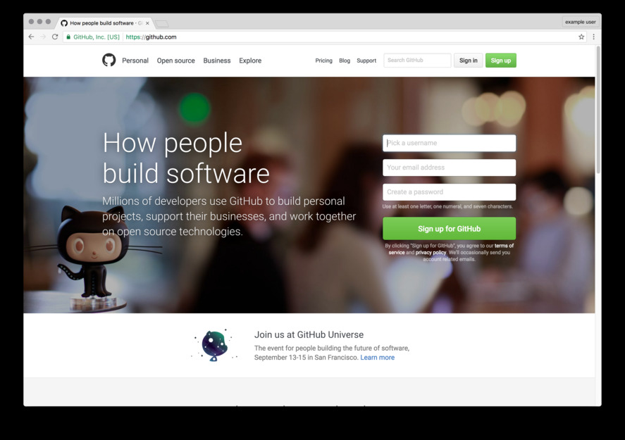
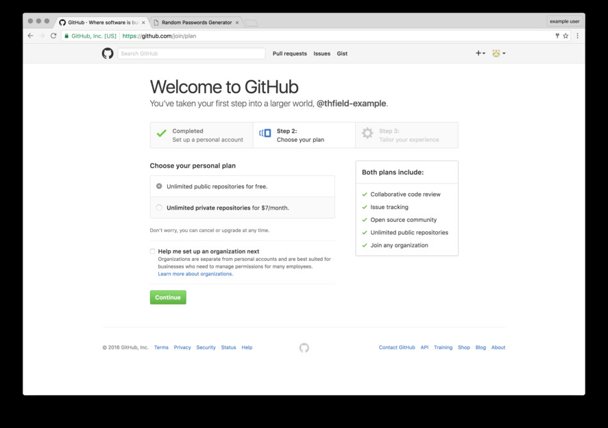
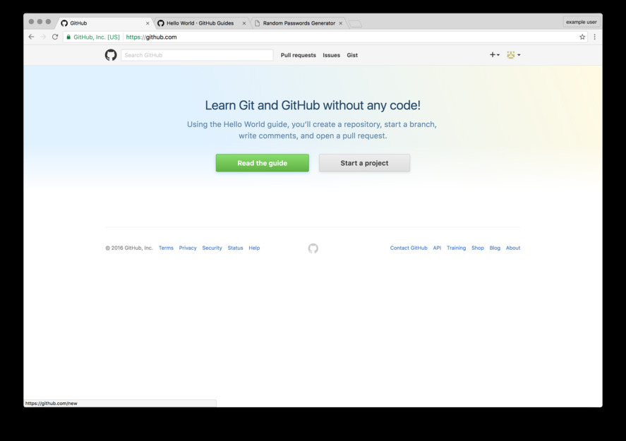

# Getting Started
Do these things before the workshop starts.

## Git
[Install Git](https://git-scm.com/book/en/v2/Getting-Started-Installing-Git)

### Linux
`sudo yum install git-all`  or
`sudo apt-get install git-all`

### Mac
Install Xcode Command Line Tools: With Mavericks and above try running `git` from the command line.  
Or install the Github [desktop GUI tool](https://desktop.github.com/)

### Windows
[Official build](http://git-scm.com/download/win)  
Or install the Github [desktop GUI tool](https://desktop.github.com/)

## Github

[Sign up](http://www.github.com) for an account:
1. 
1. 
1. 

[<-Previous](README.md)  [Next->](vcs.md)